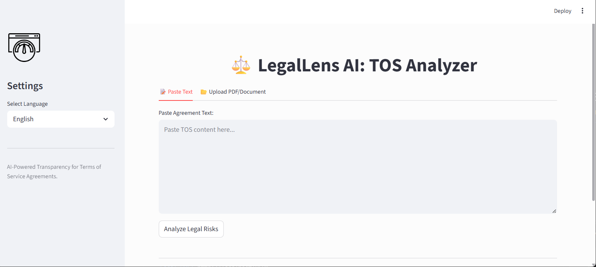
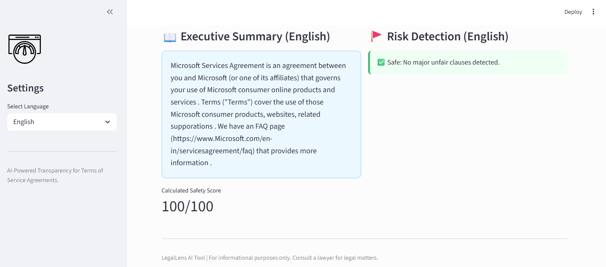

# ⚖️ LegalLens AI: Terms of Service Analyzer

[](https://www.python.org/)
[](https://streamlit.io/)
[](https://huggingface.co/nlpaueb/legal-bert-base-uncased)

**LegalLens AI** is a state-of-the-art tool designed to empower users by de-mystifying complex legal jargon found in "Terms of Service" (TOS) agreements. Using a hybrid architecture of **Legal-BERT** and **SVM**, the platform identifies predatory clauses, summarizes content, and provides a safety score in multiple languages.

---

## 🌟 Key Features

- **📂 Multi-Format Input**: Support for direct text pasting and PDF document uploads.
- **🚩 Risk Detection**: Automatically flags unfair clauses such as *Arbitration*, *Unilateral Changes*, and *Liability Limitations*.
- **🌐 Multilingual Support**: Analyzes documents and provides summaries in English, Hindi, Spanish, French, Arabic, and German.
- **📊 Safety Scoring**: A dynamic metric that grades the "friendliness" of an agreement from 0 to 100.
- **📝 AI Summarization**: Condenses 20-page legal documents into a readable executive summary.

---

## 📸 Screenshots

### 1. User Interface & Input

*A clean, intuitive interface for pasting text or uploading legal documents.*

### 2. Deep Analysis & Risk Assessment

*AI-powered executive summary and identified risks with a calculated safety score.*

---

## 🧠 Model Performance

The model was trained using **Legal-BERT** for feature extraction and a **OneVsRest SVM Classifier** for multi-label classification. After 10 epochs of fine-tuning, the model achieved near-perfect accuracy on legal clause detection.


### 🎯 Final Evaluation Scores
| Dataset | Micro F1 Score | Macro F1 Score |
| **Training** | `0.9998` | `0.9969` |
| **Validation** | `0.9943` | `0.8720` |
| **Testing** | `0.9939` | `0.8621` |

---

## 🛠️ Tech Stack

- **Backend:** Python, PyTorch
- **Machine Learning:** Transformers (HuggingFace), Scikit-Learn, Joblib
- **Frontend:** Streamlit
- **Translation:** Deep-Translator (Google API)
- **Document Processing:** PyPDF2

---

## 🚀 Installation & Usage

1. **Clone the repository:**
   ```bash
   git clone https://github.com/YOUR_USERNAME/LegalLens.git
   cd LegalLens
2. **Install dependencies:**
   ```bash
   pip install -r requirements.txt
3. **Run the application:**
   ```bash
   streamlit run app.py

## ⚖️ Disclaimer
Important: This tool is powered by Artificial Intelligence and is intended for informational purposes only. It does not constitute legal advice. Users should consult with a qualified legal professional for official contract interpretations.
